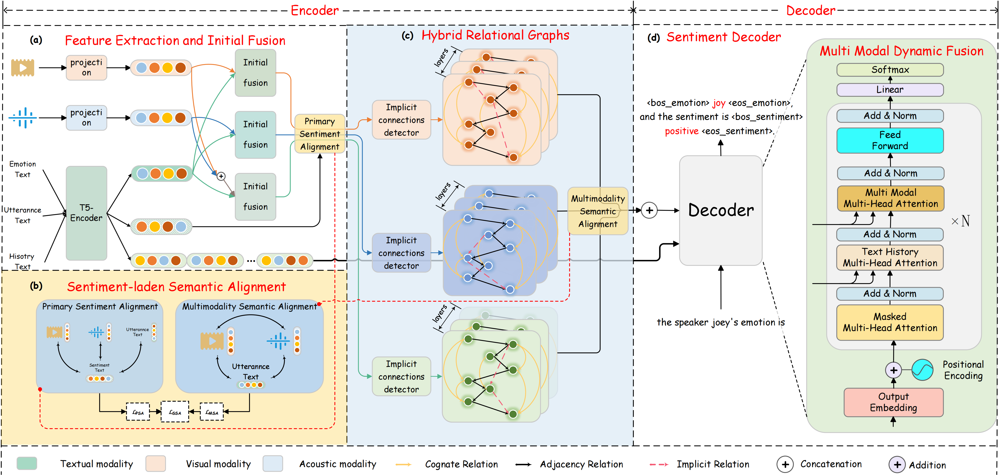
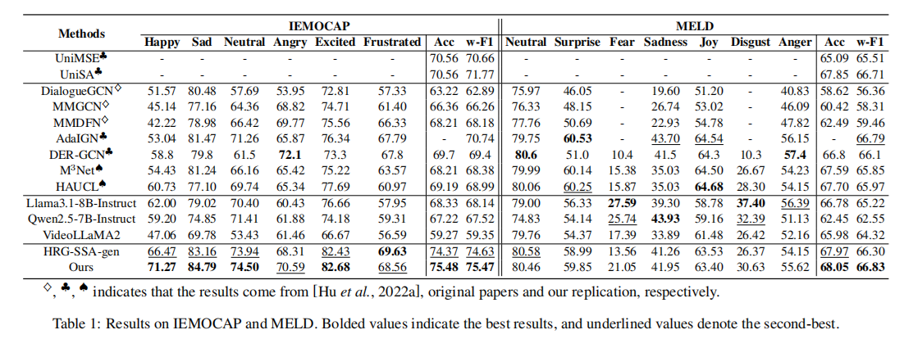

# Hybrid Relational Graphs with Sentiment-laden Semantic Alignment for Multimodal Emotion Recognition in Conversation

Pytorch implementation for the paper: [Hybrid Relational Graphs with Sentiment-laden Semantic Alignment for Multimodal Emotion Recognition in Conversation]

### Framework



### Requirements

```python
pip install -r requirements.txt
```

### Dataset

The raw data can be found at [IEMOCAP](https://sail.usc.edu/iemocap/ "IEMOCAP") and [MELD](https://github.com/SenticNet/MELD "MELD").

In our paper, we use pre-extracted features. The multimodal features are available at [IEMOCAP](https://drive.google.com/drive/folders/1I5uNGOHMTvA6KdzATYmu7P8Z4Ihce6Mi?usp=drive_link) and [MELD](https://drive.google.com/drive/folders/1rtJ8pMbkPIzZEPzZH1-QWrY2yeSRGhki?usp=drive_link).

###### Due to anonymity restrictions, we will provide it at a later time.

###  Results on IEMOCAP and MELD



### Pretrained T5 Download

Before starting, make sure to download the parameters of the [T5-base](https://huggingface.co/google-t5/t5-base) pre-trained model into the `pretrained_model` directory.

### Training examples

The implementation results may vary with training machines and random seeds.

To train on IEMOCAP:

```bash
python main.py -backbone ./pretrained_model -run_type train -dataset iemocap -use_gat -window_size 8 -gat 1 -emotion_first -use_video_mode -use_audio_mode
```

To train on MELD:

```bash
python main.py -backbone ./pretrained_model -run_type train -dataset meld -use_gat -emotion_first -use_video_mode -use_audio_mode
```

### Predict and Checkpoints

We provide the pre-trained checkpoint on IEMOCAP at [here](https://drive.google.com/drive/folders/1a9VD-r0UyeGUsJFHEIMfCtWtB1L6X3QU?usp=drive_link), and the checkpoint on MELD at [here](https://drive.google.com/drive/folders/1mdABgy7Zy5RSJTw5jFr_zzI5cuVYKGsV?usp=drive_link).

###### Due to anonymity restrictions, we will provide it at a later time.

To predict on IEMOCAP:

```bash
python main.py -run_type predict -ckpt ./iemocap-best-model/ckpt -output predict_real.json -dataset iemocap -test_batch_size=64
```

To predict on MELD:

```bash
python main.py -run_type predict -ckpt ./meld-best-model/ckpt -output predict_real.json -dataset meld -test_batch_size=64
```

